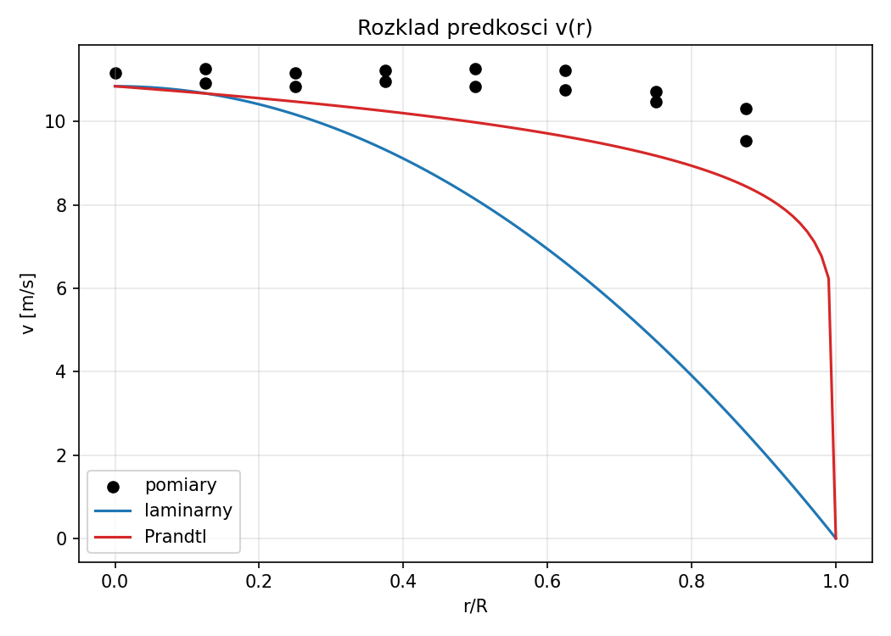

Grupa lab: 3
Data wykonania: 14.04.2026
Data odbioru: 21.04.2026

Temat cwiczenia

WYZNACZENIE ROZKLADU PREDKOSCI STRUGI W KANALE

Imiona i nazwiska

Patryk Koz?owski, Oliwier Kruczek,

Ocena i uwagi

# I. Cel cwiczenia
Celem cwiczenia jest zapoznanie sie z metoda pomiaru predkosci plynu przy pomocy rurki Prandtla oraz okreslenie rozkladu predkosci w przewodzie o przekroju kolowym.

# II. Schemat stanowiska pomiarowego
Rys. 1 Schemat stanowiska pomiarowego
W sklad stanowiska wchodzily: rurociag, rurka Prandtla, mikromanometr oraz skala pomiarowa. Medium robocze stanowilo powietrze tloczone przez wentylator z regulacja natezenia przeplywu.
Rurka Prandtla sluzyla do wyznaczania cisnienia dynamicznego, a jej pozycje ustawiano na skali pomiarowej, co pozwalalo na odczyt polozenia osi w przekroju. Odczyt cisnien realizowano mikromanometrem.

Przyrzady pomiarowe:
1. Mikromanometr HD 2114P.2

Rys. 2 Mikromanometr HD 2114P.2
Przenosne urzadzenie do pomiaru cisnienia roznicowego, nad- i podcisnienia gazow nieagresywnych (zakres do 20 mbar).

2. Sonda Prandtla

Rys. 3 Sonda Prandtla
Przyrzad pomiarowy zlozony z dwoch koncentrycznych rurek, umozliwiajacy pomiar cisnienia calkowitego i statycznego oraz wyznaczenie cisnienia dynamicznego.

# III. Wyniki pomiarow w tabeli

Metoda Log-Czebyszewa (predkosc srednia)

| L.p | r [m] | dp [Pa] | v [m/s] |
| --- | --- | --- | --- |
| 3g | 0.0750 | 51.00 | 9.360 |
| 2g | 0.0550 | 62.00 | 10.320 |
| 1g | 0.0250 | 67.00 | 10.728 |
| 0 | 0.0000 | 68.50 | 10.847 |
| 1d | -0.0250 | 72.50 | 11.160 |
| 2d | -0.0560 | 67.00 | 10.728 |
| 3d | -0.0750 | 38.00 | 8.079 |

Rozklad predkosci v=v(r)

| L.p | r [m] | dp [Pa] | v [m/s] |
| --- | --- | --- | --- |
| 7g | 0.0700 | 62.00 | 10.320 |
| 6g | 0.0600 | 64.00 | 10.485 |
| 5g | 0.0500 | 67.50 | 10.768 |
| 4g | 0.0400 | 68.50 | 10.847 |
| 3g | 0.0300 | 70.00 | 10.966 |
| 2g | 0.0200 | 68.50 | 10.847 |
| 1g | 0.0100 | 69.50 | 10.926 |
| 0 | 0.0000 | 72.50 | 11.160 |
| 1d | -0.0100 | 74.00 | 11.275 |
| 2d | -0.0200 | 72.50 | 11.160 |
| 3d | -0.0300 | 73.50 | 11.236 |
| 4d | -0.0400 | 74.00 | 11.275 |
| 5d | -0.0500 | 73.50 | 11.236 |
| 6d | -0.0600 | 67.00 | 10.728 |
| 7d | -0.0700 | 53.00 | 9.542 |

# IV. Obliczenia
Dane wejsciowe: t = 24.00 C, pb = 99858.18 Pa, ps = 19.00 Pa, phi = 50.0 %, D = 0.1600 m

Rzeczywiste parametry powietrza:
T = 297.15 K, p_abs = 99877.18 Pa, rho = 1.1643 kg/m3, mu = 1.832568e-05 Pa*s, nu = 1.573959e-05 m2/s

Log-Czebyszew:
v_srednia = 10.062 m/s (punkt 0 wliczony: nie), v_max = 10.847 m/s
Re = 102289 (turbulentny)
n (Prandtl) = 8.32
v_srednia/v_max (teoria) = 0.830
v_srednia/v_max (pomiar) = 0.928

Teoretyczny rozklad predkosci (dla punktow profilu):
| L.p | r/R | v_zmierz [m/s] | v_teoria [m/s] |
| --- | --- | --- | --- |
| 7g | 0.875 | 10.320 |  |
| 6g | 0.750 | 10.485 |  |
| 5g | 0.625 | 10.768 |  |
| 4g | 0.500 | 10.847 |  |
| 3g | 0.375 | 10.966 |  |
| 2g | 0.250 | 10.847 |  |
| 1g | 0.125 | 10.926 |  |
| 0 | 0.000 | 11.160 |  |
| 1d | 0.125 | 11.275 |  |
| 2d | 0.250 | 11.160 |  |
| 3d | 0.375 | 11.236 |  |
| 4d | 0.500 | 11.275 |  |
| 5d | 0.625 | 11.236 |  |
| 6d | 0.750 | 10.728 |  |
| 7d | 0.875 | 9.542 |  |

# V. Wykres rozkladu predkosci

# VI. Wnioski
Wpisz wnioski na podstawie uzyskanych wynikow.